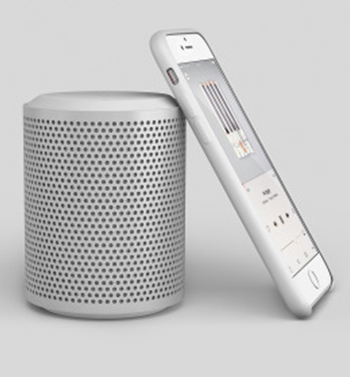
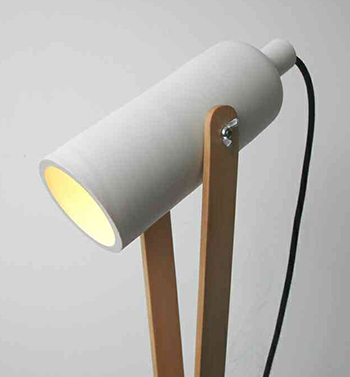

--------- Color----------
Ash: #8e8e8e;

          

              

                  All
                  App Design
                  Web Design
                  UI Design
                  Photoshop
              

          

            

              

                  

                      

                          

                              <!--Single Portfolio start-->
                              

                                

                                    
                                    

                                          <a href="#"><i class="pe-7s-plus"></i></a>
                                    

                                    

                                      <h3>Project Title</h3>
                                      
App Design

                                    

                                

                              

                              <!--Single Portfolio end-->
 
                              <!--Single Portfolio start-->
                              

                                

                                    
                                    

                                          <a href="#"><i class="pe-7s-plus"></i></a>
                                    

                                    

                                      <h3>Project Title</h3>
                                      
App Design

                                    

                                

                              

                              <!--Single Portfolio end-->
 
                              <!--Single Portfolio start-->
                              

                                

                                    
                                    

                                          <a href="#"><i class="pe-7s-plus"></i></a>
                                    

                                    

                                      <h3>Project Title</h3>
                                      
App Design

                                    

                                

                              

                              <!--Single Portfolio end-->
 
                              <!--Single Portfolio start-->
                              

                                

                                    
                                    

                                          <a href="#"><i class="pe-7s-plus"></i></a>
                                    

                                    

                                      <h3>Project Title</h3>
                                      
App Design

                                    

                                

                              

                              <!--Single Portfolio end-->
 
                              <!--Single Portfolio start-->
                              

                                

                                    
                                    

                                          <a href="#"><i class="pe-7s-plus"></i></a>
                                    

                                    

                                      <h3>Project Title</h3>
                                      
App Design

                                    

                                

                              

                              <!--Single Portfolio end-->
 
                              <!--Single Portfolio start-->
                              

                                

                                    
                                    

                                          <a href="#"><i class="pe-7s-plus"></i></a>
                                    

                                    

                                      <h3>Project Title</h3>
                                      
App Design

                                    

                                

                              

                              <!--Single Portfolio end-->
 
                          

                      
                    
              

          

          

          #service{
    background-color: #f8f8f8;
}
#service .filter{
    margin: 110px 0 30px;
}
#service .filter span{
    margin: 0 20px;
    padding: 10px;
    border: 1px solid;
    font-family: 'Roboto', sans-serif;
    text-transform: uppercase;
    cursor: pointer;
    color: #8e8e8e;
    transition: .3s;
}
#service .filter span.active{
    color: #000;
}
.work-heading h2{ 
    margin-top: 10px;
}
.mar-bot{
    margin-bottom: 25px;
}
.gallery .single-project .item-img img{
    width: 100%;
}
.item-img {
    position: relative;
    overflow: hidden;
}
.item-img img{
    width: 100%;
}
.item-img:hover img{
    transform: scale(1.2);
    transition: all 1s ease 0s;
}
.item-img::after{
    content: '';
    position: absolute;
    top: 0;
    left: 0;
    width: 100%;
    height: 100%;
    background-color: #33333379;
    opacity: 0;
    transition: all 1s ease 0s;
}
.item-img:hover:after{
    opacity: 1;
    transition: all 1s ease 0s;
}
.project-icon{
    position: absolute;
    width: 100%;
    height: auto;
    top: 0;
    display: flex;
    justify-content: center;
    visibility: hidden;
    z-index: 1;
}
.item-img:hover .project-icon {
    top: 30%;
    transition: all 1s ease 0s;
    visibility: visible;
}
.project-icon a i{
    font-size: 60px;
    color: #fff;
}
.project-title{
    padding: 15px;
    background-color: #fff;
    position: absolute;
    width: 100%;
    bottom: -100%;
    opacity: 0;
    z-index: 9999;
}
.item-img:hover .project-title{
    bottom: 0;
    opacity: 1;
    transition: all 1s ease 0s;
}
.project-title p{
    margin-top: 18px;
    line-height: 0;
}